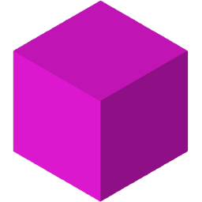

##  BetterSpades

* Replicate of the great game *Ace of Spades* (classic voxlap)
* runs on very old systems back to OpenGL 1.1
* shares similiar if not even better performance to voxlap

## Build requirements

These libraries and files are needed:

| Name        | License         | Usage                 | Github                                         |
| ----------- | --------------- | --------------------- | :--------------------------------------------: |
| GLFW3       | *ZLib*          | OpenGL context        | [Link](https://github.com/glfw/glfw)           |
| OpenAL soft | *LGPL-2.1*      | 3D Sound env          | [Link](https://github.com/kcat/openal-soft)    |
| dr_wav      | *Public domain* | wav support           | [Link](https://github.com/mackron/dr_libs/)    |
| LodePNG     | *MIT*           | png support           | [Link](https://github.com/lvandeve/lodepng)    |
| libdeflate  | *MIT*           | decompression of maps | [Link](https://github.com/ebiggers/libdeflate) |
| enet        | *MIT*           | networking library    | [Link](https://github.com/lsalzman/enet)       |

You will need to compile

* GLFW3
* OpenAL soft
* libdeflate
* and enet

by yourself or get hold of precompiled binaries. Place produced static libaries in `lib/`.

Some files need to be copied to the `src/` directory.

This means:
| source         | &rightarrow; | destination |
| -------------- | ------------ | ----------- |
| `dr_wav.h`     | &rightarrow; | `src/dr_wav.c` <br /> Make sure to define `DR_WAV_IMPLEMENTATION` in *Line 9* |
| `lodepng.h`    | &rightarrow; | `src/lodepng/lodepng.h` |
| `lodepng.cpp`  | &rightarrow; | `src/lodepng/lodepng.c` |
| `libdeflate.h` | &rightarrow; | `src/libdeflate.h` |

Because state of copyright of 0.75 assets is unknown, you will need to get them *[here](http://aos.party/bsresources.zip)*. Unzip the file and extract all contents to `resources/` manually.

#### Windows

This project uses CMake to generate all Makefiles automatically. It's best to use MinGW for gcc on windows. You can generate the required files by opening `cmd.exe` in the `build/` directory and typing:
```
cmake -G "MinGW Makefiles" ..
make
```
If everything went well, the client should be in the `bin/` subfolder.

You can start it with each of the following:

* `run_min_gfx.bat` will launch the client with the lowest and least demanding settings
* `run_max_gfx.bat` is the most you can get

See the client's source to understand what each value inside the script means.

#### Linux

Compilation now works the same on linux. Just change the build system to `Unix Makefiles`.

You can build each library yourself, or install them with your distro's package manager:
```
apt-get install libgl1-mesa libgl1-mesa-dev libopenal1 libopenal-dev libglfw-dev libenet-dev
```

## Gallery

|  |  |
| :-: | :-: |

##

>*Donations are greatly appreciated* :+1:
>
> `1AeSfdVmbEX6VCqxCgk9WkzSA8XJkKr4FM`
